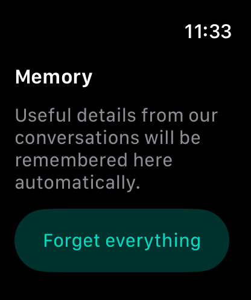
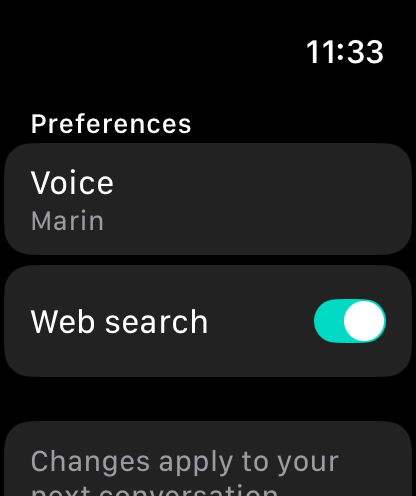
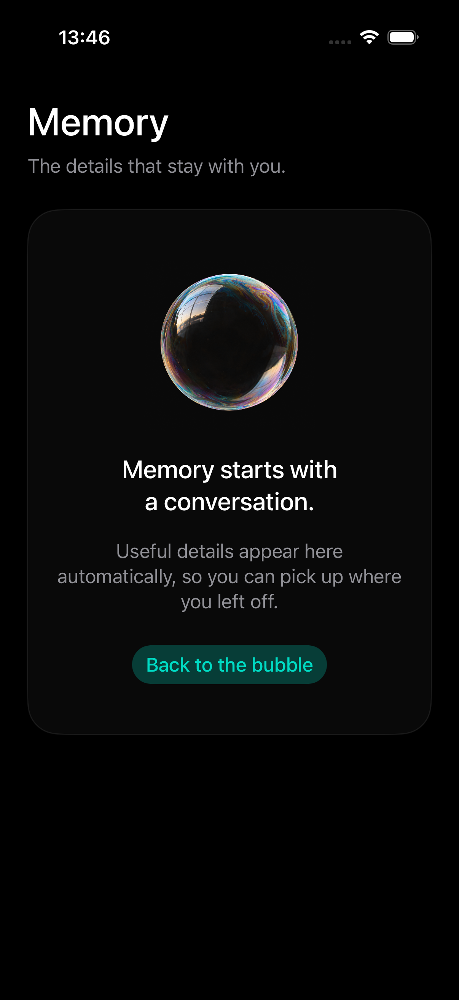
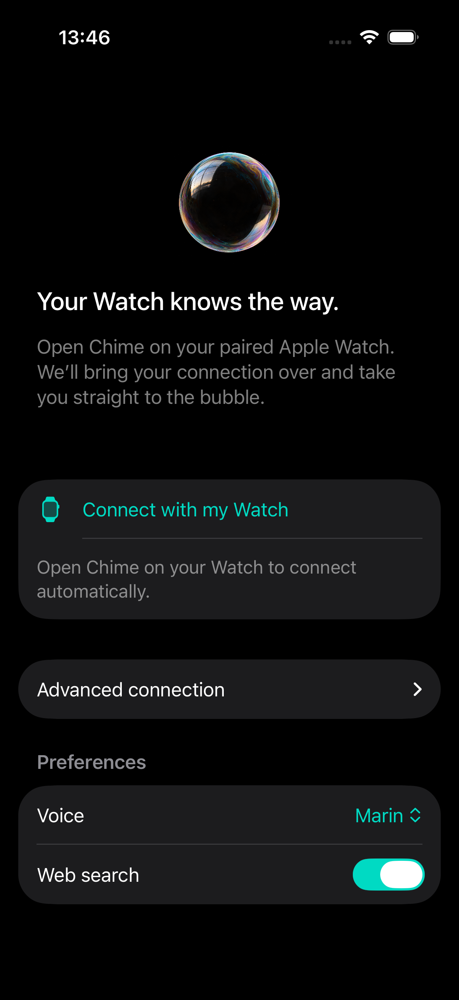
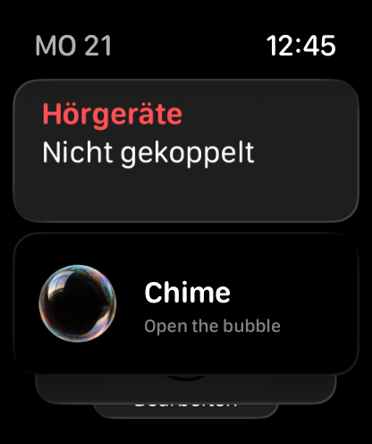

# Chime 🫧


**A quiet bubble. A conversation when you need one.**

Chime puts a reflective soap bubble on your iPhone and Apple Watch. Tap it to talk; tap again
to end the conversation. It grows when the microphone is enabled and pulses with
your voice and the agent’s reply. Useful details become compact memory for next time.

## On your wrist

| Memory · swipe right | Bubble · home | Preferences · swipe left |
| :---: | :---: | :---: |
|  |  |  |

Actual screenshots from the watchOS 26.5 simulator. The memory screenshot shows a
fresh conversation store; your page fills with remembered details automatically.

| Bubble state | What you see |
| --- | --- |
| Microphone off or muted | A small bubble |
| Microphone enabled | A larger bubble |
| Speech coming in or playing out | Pulses driven by the audio level |
| Connecting or ending | A small bubble with a progress indicator |

The center screen stays fixed: no vertical scrolling, no Crown scrolling or zoom,
no branding, and no tap reminder. Swipe horizontally to open the two side pages.
The Digital Crown remains available for their content and preferences. VoiceOver
announces the conversation state; Reduce Motion disables pulsing and animated transitions.
Animation also pauses on a dimmed or inactive display and when the bubble is offscreen.

## Conversations that carry forward

Memory is compiled automatically after calls and saved on each device before older
transcripts are pruned. The latest 12 turns remain for continuity; failed updates keep
their source text for retry. The next voice session receives compact memory and bounded
recent context. The memory page shows useful facts and ongoing context, with a confirmed
**Forget everything** action. Summaries can lose detail or make mistakes; they are not
verbatim conversation history.

Preferences offer voice selection and web search. Connection credentials are configured
on the iPhone and sent to its paired Watch, so there are no server addresses or tokens to type on the Watch.
This is app-managed memory, separate from ChatGPT account memory or cross-device cloud sync.

Chime ends a call when it enters the background. Muting keeps it connected; tap the
bubble again to disconnect. Audio is streamed through the gateway and is not saved to
files by Chime. OpenAI credentials remain on the server.

On iPhone, Apple's voice processing provides echo cancellation, noise suppression,
and automatic microphone gain. The microphone stays open during agent speech so you
can interrupt or ask a simple question while research continues. GPT-Live decides
when to speak; there is no app-level volume threshold that cuts off quiet speech.
Playback uses a short 180 ms refill cushion to absorb network jitter. Opening the
app checks gateway health to begin waking an idle server without starting a billed
voice session. Free Render instances can still need a cold start after inactivity.

The current Series 8 audio path takes turns: the microphone is silenced during the
agent’s reply and a short acoustic tail to avoid echo. Spoken interruption is not yet
supported on Watch. The tested device could not start the voice-processing audio unit, so Chime
uses ordinary audio I/O with asynchronous audio-session activation.

See [Watch setup and interaction checks](watch/SETUP.md),
[bubble artwork and motion](watch/ARTWORK.md), and
[screenshot provenance](docs/images/README.md).

When OpenClaw is connected, it supplies the agent's identity: Chime is the app,
not a hardcoded assistant name. Identity questions are resolved through the
connected agent, without adding an identity lookup to connection startup. Simple
questions stay with GPT-Live while research runs asynchronously; dependent agent
actions remain serialized and are never retried automatically.

## Run the gateway

Requires Node.js 22+ and an OpenAI project with access to `gpt-live-1` and the
configured Responses backend model.

```bash
cd gateway
npm ci
cp .env.example .env
```

Set these values in `gateway/.env`:

```dotenv
OPENAI_API_KEY=your-openai-project-key
GATEWAY_TOKENS=your-private-watch-token:your-user-id
PORT=8788
LIVE_BACKEND_MODEL=gpt-5.6-luna
```

Then run `npm start`. Check reachability with `curl http://localhost:8788/health`.
The health endpoint checks the gateway process, not OpenAI credentials or model
access. Live voice does not need LiveKit, Anthropic, or Perplexity.

## Run the iPhone app and distribute with TestFlight

| Memory | Bubble · home | Automatic setup |
| :---: | :---: | :---: |
|  |  |  |

Select the shared **Chime** scheme in Xcode to run on an iPhone (iOS 26.5+).
The app includes the Watch app and its widgets. Both use the same bubble, audio,
preferences, and memory implementation. On a fresh phone install, Preferences
opens for automatic setup from an already-configured Watch. Open Chime on both
devices; the iPhone receives the connection and returns to the bubble. Manual
HTTPS gateway and service-token entry is tucked under **Advanced connection**
for installations without a configured counterpart. Subsequent connection
changes on iPhone still update the Watch through WatchConnectivity. Voice preferences and memory remain
local to each device. No private service token or OpenAI key is bundled in a release.

See [TestFlight release and installation](ios/TESTFLIGHT.md) for signing,
archiving, uploads, and first-run setup.

## Run the Watch app

1. Open `chime.xcodeproj` in Xcode. The project targets **watchOS 26.5+**; configure your signing team.
2. Connect your Watch through its paired iPhone and obtain its ID with `xcrun devicectl list devices`.
3. Configure the private Watch token in the ignored `gateway/.env` (or set `WATCH_TOKEN`). Then install:

   ```bash
   GATEWAY_URL=https://your-gateway.example.com ./scripts/install-watch.sh YOUR_WATCH_ID
   ```

   Use `--fresh` on the first installation if no preferences file exists. The installer merges
   credentials into device preferences without embedding them in the bundle, preserving voice
   preferences and memory. This personal development workflow is not public account enrollment.
4. Tap the bubble and allow microphone access. Swipe left for preferences or right for memory;
   no connection fields need to be entered on the Watch.

Use HTTPS/WSS for a remote gateway, with WebSocket upgrades enabled. `localhost`
on a physical Watch refers to the Watch itself, so use a reachable gateway hostname.
The OpenAI API key goes only in the gateway environment, never in Watch settings.
Verify audio, echo behavior, interruptions, and Bluetooth routing on real
hardware before distributing a build.

## Architecture

```text
Apple Watch — AVAudioEngine + SwiftUI
    │ authenticated WebSocket /v1/live
    ▼
Chime gateway — Node.js + ws
    │ server-owned session.start, PCM16 mono / 24 kHz
    ▼
OpenAI GPT-Live — gpt-live-1
    └── Responses backend — reasoning and optional web search
```

The gateway waits for `session.started` before accepting audio, allows only audio
and input-control commands, bounds message and output queues, and finalizes the
upstream session when the Watch disconnects. The Watch resamples microphone audio
and plays raw PCM directly without temporary WAV files.

`chime Watch App/` contains the active application. `gateway/src/live.ts` implements
the voice relay. The `agent/` worker and the gateway’s Claude routes remain for
legacy integrations; Claude memory and connected-app tools are not part of the
GPT-Live conversation. See [gateway documentation](gateway/README.md) for details.

## Validation

```bash
cd gateway
npm run typecheck
npm test
```

Run the Watch checks on macOS from the repository root:

```bash
./scripts/check-watch.sh
```

This runs audio conversion and level-metering tests, transcript persistence, and memory lifecycle tests, checks compatibility
with existing saved data, and compiles the app and widget extension sources with strict concurrency
checks. It uses the SDK in `/Applications/Xcode.app`; set `DEVELOPER_DIR` if Xcode
is installed elsewhere. These checks do not package, sign, or launch the app.

Gateway tests use a mock GPT-Live upstream and cover authentication, protocol
validation, audio and caption relay, and disconnect cleanup. Build the Watch target
in Xcode and test a live conversation with configured credentials on hardware.

## Open Chime quickly

Add **Chime** to your Watch face's complications or pin its bubble widget in the
Smart Stack. You can also say **“Open Chime”** to Siri on the Watch or use its
Shortcuts action. Each opens the bubble; tap it to begin listening.
See [quick-access setup](watch/SETUP.md#quick-access-from-your-wrist) for instructions.



## Connect an OpenClaw agent

Chime can keep its live voice while delegating workspace questions and authorized
actions to your hosted OpenClaw agent. Configure the connection on the gateway;
no tokens or connection forms are needed on the Watch. See the
[OpenClaw setup guide](gateway/README.md#connected-openclaw-agent-optional).
OpenClaw memory remains separate from the Watch's compiled conversation memory.

## Troubleshooting

- **Cannot connect:** check gateway reachability, the Watch token, WSS proxy support,
  `OPENAI_API_KEY`, and access to both configured OpenAI models.
- **Microphone unavailable:** allow Chime microphone access in Watch settings.
- **Audio falls behind:** reconnect on a better network. Chime ends sessions with
  excessive buffering rather than playing increasingly delayed speech.
- **Web search unavailable:** enable it in settings before starting a new session.
- **Changes do not apply mid-call:** end the conversation, update settings, then reconnect.

API references: [GPT-Live](https://developers.openai.com/api/docs/guides/live),
[WebSocket audio](https://developers.openai.com/api/docs/guides/voice-websockets?api=live),
[session lifecycle](https://developers.openai.com/api/docs/guides/live-conversations).

## License

See [LICENSE](LICENSE).
